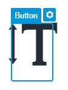
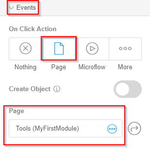

# Add a Click Action to the Tools Action Button

To add a click action to open a page to the action buttons in the **Tools** Card Action, follow these steps:

1.   Select the **Tools** action button. 

    

2.   In the right toolbar, under the **Events** menu, for the **On Click Option** select **Page**. 
3.   In the **Page** list, select the **Tools** page. 

    

