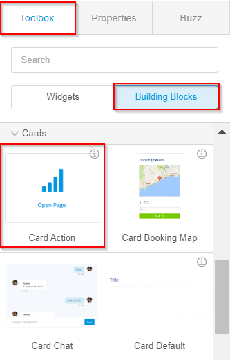
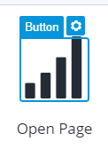
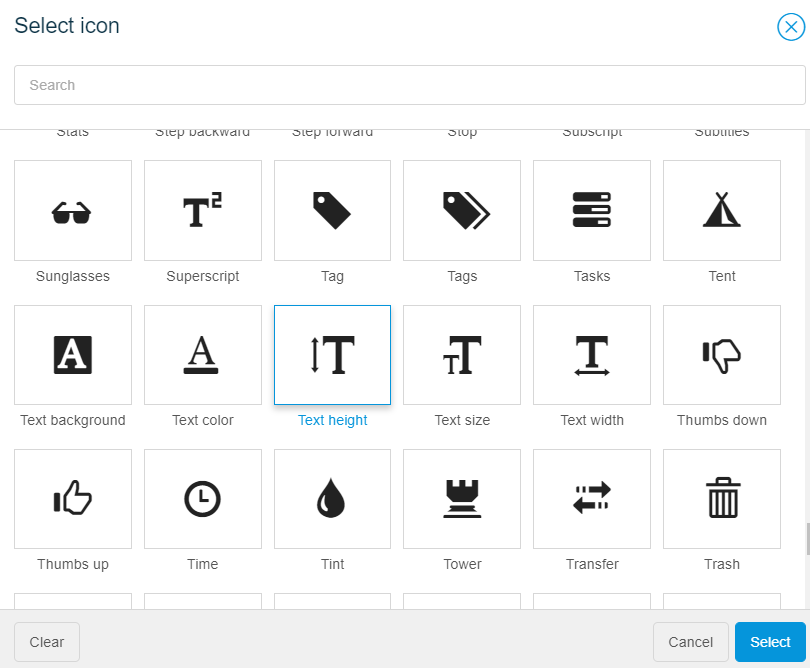
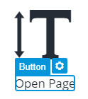
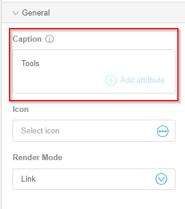

# Add a Tools Card Action to a Row

A card action can be used for dashboards or add a call to action \(CTA\) on a dashboard or a page. For more information, see [Card Action](https://atlas.mendix.com/p/bb_actioncard/7318349394477061) .

To add a card action to a row, follow these steps:

1.   Select a row in the dashboard to add a card action. 
2.   In the top right corner of the studio, select **Toolbox** \> **Building Blocks**. 
3.   From the cards menu, drag and drop Card Action to the selected row. 

    

4.   Select the Icon button of the Card Action. 

    

5.   In the right toolbar, under the **General** menu, from the **Icon** list, select an icon. 

    

6.   Select the Caption button of the Card Action. 

    

7.   In the right toolbar, under the **General** menu, in the **Caption** box, type **Tools**. 

    

An action button can perform various actions such as calling a microflow, a nanoflow, or opening a page.

For more information, see [Action Button](https://docs.mendix.com/refguide/action-button).

