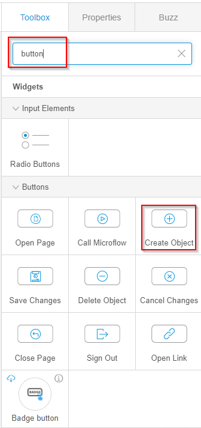
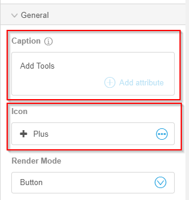

# Add the Add Tools Button to the Tools Page

To add the **Add Tools** button the Tools page, follow the steps below:

1.   Open the **Tools** page in the Studio. 
2.   In the right toolbar, search **button**. 
3.   Drag and drop the **Create Object** button to the **Tools** page. 

    

4.   Select the **Create Object** button on the Tools page. 
5.   In the right toolbar, under the General menu, in the **Caption** box, delete **New** and type **Add Tool**. 
6.   From the **Icon** list, select an icon. 

    

7.   In the right toolbar, under the **Events** menu, for the **On Click Action**, select **Pages**. 
8.   From the **Pages** list, select the **Add Tool** page. 

