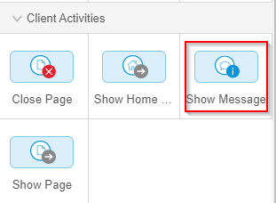

# Create a Microflow

To create a microflow to display a message, follow the steps below:

1.   In the left toolbar of the studio, click **Microflows** . 
2.   In the Microflows sidebar, click **New**. 
3.   In the **Create new microflow** page, type the **Name** of microflow as **Save**. 

    

4.   Click **Create** to create and open the new microflow. 

    

5.   In the right toolbar, from the **Genral** menu, drag and drop the **Parameter** block in the microflow page. 
6.   Select the **Parameter** block in the microflow page. 
7.   In the right toolbar, under the **Definitions** list, in the **Entity** list, select **Tools**. 

    

8.   In the right toolbar, from the **Client Activities** menu, drag and drop the **Show Message** block in the **Save** microflow. 

    

9.   Select the **Show Message** block in the Save microflow. 
10.  In the right toolbar, under the **Data Source** menu, in the **Type** list, select **Information** and in the **Template** box, type **Tool saved successfully!** 

    

11.  In the right toolbar, from the **Client Activities** menu, drag and drop the **Show Page** block after the Show Message block in the **Save** microflow. 

    

12.  Select the **Show page** block in the Save microflow. 
13.  In the right toolbar, under the **Data Source** menu, in the **Page** list, select the **Tools** page. 
14.  In the right toolbar, from the **Object Activities** menu, drag and drop the **Commit** block after the **Show page** block in the **Save** microflow. 

    

15.  Select the **Commit** block in the Save microflow. 
16.  In the right toolbar, under the **Data Source** menu, in the **Object or List** , select **Tools**. 

    

