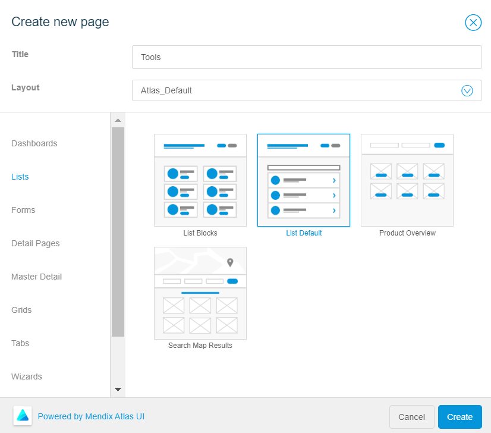
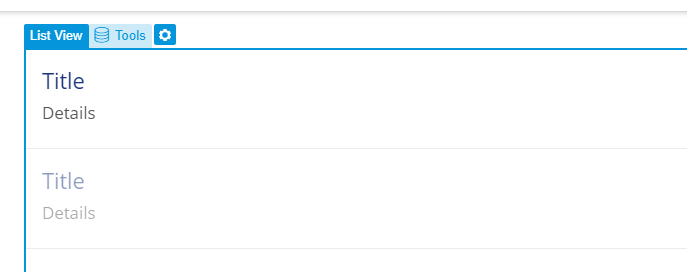
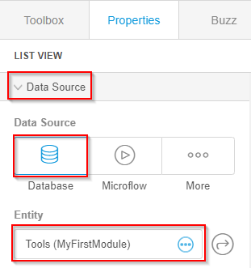
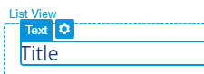
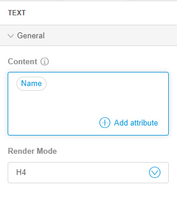

# Create a Tools Page

To create a page, follow these steps:

1.   In the left toolbar of the studio, click **Pages** . 

2.   In the **Pages** sidebar, click **New**. 

3.   In the Create New Page modal window, do the following: 

    *  In the **Title** box, type the page name as Tools.
    *  From the **Layout** list, select **Atlas\_Layout**.
    *  In the page types, click **Lists** and select **List Default**.
   
   

4.   Click **Create**. 

5.   Select the **List View** in the Tools page. 

   

6.   In the right toolbar, under the **Data Source** menu, select **Database**. 

7.   In the **Entity** list, select the **Tools** entity. 

   

8.   Select the **Title** text of a list item. 

   

9.   In the right toolbar, under the **General** menu, in the **Content** box, delete the text **Title**. 

10.  In the **Content** box, click .

11.  In the Select Attribute page, select **Name**. 

   

12.  Repeat steps 8 to 12 for the **Details** text of a list item to add the **Code** attribute. 

