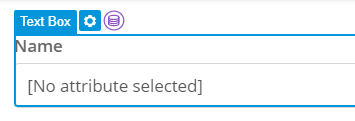
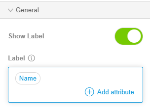

# Create a Page to Add a Tool to the Tools Page

To create a page to add a tool to the Tools page, follow these steps:

1.   In the left toolbar of the studio, click **Pages** . 

2.   In the **Pages** sidebar, click **New**. 

3.   In the Create New Page modal window, do the following: 

    * In the Title box, type the page name as Add Tool.
    * From the Layout list, select Atlas\_Layout.
    * In the page types, click Forms and select Form Vertical.
    
   

4.   Click **Create**. 

5.   Select the **Data View** in the Tools page. 

   

6.   In the right toolbar, under the **Data Source** menu, select **Context**.

7.   In the **Entity** list, select the **Tools** entity. 

    

8.   Select the **Name** text box. 

    

9.   In the right toolbar, under the **General** menu, in the **Label** box, delete the text **Name**. 

10.  In the **Label** box, click . 

11.  In the Select Attribute page, select **Name**. 

   

12.  Repeat steps 8 to 12 for the other text box to add the **Code** attribute label. 

