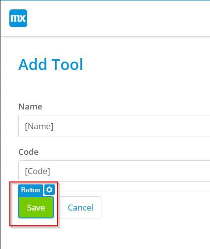
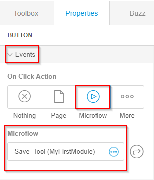

# Add Microflow to Display a Message

To add a microflow to an action button to display a message, follow the steps below:

1.   In the Studio, open the Add Tool page. 
2.   Select the **Save** button. 

    

3.   In the right toolbar, under the **Events** menu, for the **On Click Action**, select **Microflow**. 
4.   From the Microflow list, select the **Save\_Tool** microflow. 

    

    For more information about creating a microflow, see [Create a Microflow](create_a_microflow.html#).

