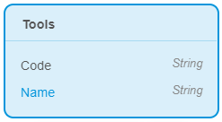

# Create Entities and Attributes

To create entities and their attributes, follow these steps:

1.   In the left toolbar of the studio, click **Domain Modules** . 
2.   In the Domain Module sidebar, click **MyFirstModule**. 
3.   From the top right corner of the studio, drag and drop Entity on the **MyFirstModule** page. 
4.   In the Create New Entity modal window, type name of the entity as **Tools**. 
5.   Click **Create**. 
6.   Select the Tools entity and click . 
7.   In the Create New Attribute modal window, 
    -   Type Name in the **Name** box.
    -   Select **String** as **Type**.
8.   Click **Create**. 
9.   Repeat steps 7 and 8 to create an entity by the name Code. The entity looks like this:

    

